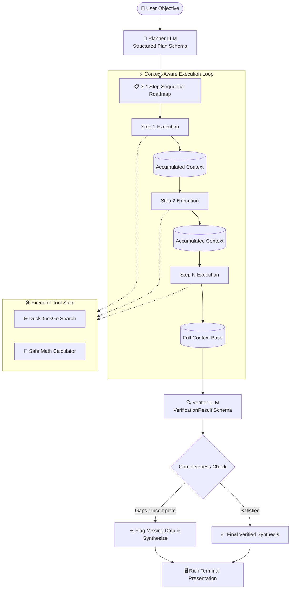
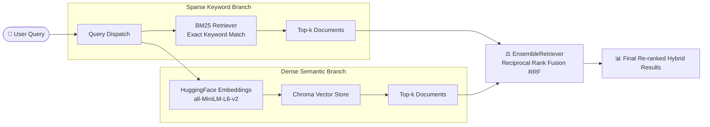

# 🤖 Agent Frameworks & Production Architectures (Week 7)

[](https://www.python.org/downloads/)
[](https://www.langchain.com/)
[](https://www.llamaindex.ai/)
[](https://ai.google.dev/)
[](https://www.trychroma.com/)
[](https://docs.pydantic.dev/)
[](https://rich.readthedocs.io/)

> **Part of the "Building Production-Level AI Agents in 10 Weeks" Series**  
> Moving from scratch-built primitives to industry-standard agent frameworks (**LangChain**, **LlamaIndex**), mastering hybrid retrieval, observability callbacks, and advanced multi-stage **Plan-and-Execute** architectures with self-verification.

---

## 📌 Executive Overview

Building AI agents from scratch develops an understanding of the underlying mechanics (tokenization, vector math, message history structures, and tool-call loops). However, production engineering requires knowing when to leverage framework abstractions for speed, maintainability, and interoperability.

This repository explores the transition from raw API calls to modern orchestration frameworks:
1. **LangChain Expression Language (LCEL)** for declarative, type-safe LLM pipelines.
2. **Hybrid Retrieval (RAG)** uniting Sparse (BM25) and Dense (Chroma + HuggingFace) search via Reciprocal Rank Fusion (RRF).
3. **ReAct Tool-Calling Agents** utilizing dynamic web search, calendar computation, and math evaluation.
4. **LlamaIndex Document Ingestion & QA** comparing data-first indexing with orchestration-first pipelines.
5. **Observability & Custom Callbacks** hooking into the framework runtime lifecycle.
6. **Plan-and-Execute with Verification Gates** mitigating infinite loops and hallucinations in complex multi-step reasoning.

---

## 🏛️ System Architectures

### 1. Plan-and-Execute with Verification Loop (`plan_and_execute.py`)



---

### 2. Hybrid Retrieval (Sparse + Dense RRF) (`hybrid_rag.py`)



---

## 📁 Repository Structure

```plaintext
frameworks-week7/
├── 📄 resume_reviewer.py       # LCEL declarative pipeline with Pydantic JSON parsing
├── 📄 hybrid_rag.py             # LangChain Hybrid Search (BM25 + Chroma + RRF)
├── 📄 react_agent.py            # LangChain ReAct agent with tools (Search, Calc, Date)
├── 📄 llamaindex_qa.py          # LlamaIndex Document Ingestion & RAG over PDFs & Notes
├── 📄 agent_callbacks.py        # Custom BaseCallbackHandler for execution observability
├── 📄 plan_and_execute.py       # Advanced Planner-Executor-Verifier multi-stage pipeline
├── 📄 JOURNAL.md                # Detailed daily engineering reflections & architectural trade-offs
├── 📁 your_docs/                # Multi-format knowledge source directory
│   ├── 📄 my_notes.md           # Markdown structured notes (Weeks 1-5 recap)
│   └── 📄 sample_paper.pdf      # Research paper for PDF RAG ingestion
├── 📄 .env.example              # Template for API keys
└── 📄 README.md                 # Project documentation
```

---

## 🔬 Deep Dive: Modules & Capabilities

### 1. Resume Reviewer (`resume_reviewer.py`)
* **Core Concept**: Modern LangChain Expression Language (LCEL) replacing manual string interpolation and raw `json.loads` parsing.
* **Pipeline**: `prompt | llm | parser`
* **Output Format**: Enforced by Pydantic `ResumeReview` schema (numerical rating, top strengths, weaknesses, and executive summary).
* **Provider**: Google Gemini `gemini-3.1-flash-lite`.

### 2. Hybrid RAG System (`hybrid_rag.py`)
* **Core Concept**: Overcomes keyword miss in dense search and semantic blindness in keyword search.
* **Mechanics**:
  * **Sparse Retriever**: `BM25Retriever` for lexical/keyword matches.
  * **Dense Retriever**: `Chroma` backed by local `all-MiniLM-L6-v2` sentence transformers.
  * **Fusion**: `EnsembleRetriever` with weighted 50/50 reciprocal rank fusion.

### 3. ReAct Tool-Calling Agent (`react_agent.py`)
* **Core Concept**: Implements the iterative *Reasoning $\rightarrow$ Action $\rightarrow$ Observation $\rightarrow$ Answer* loop using LangChain's `create_agent`.
* **Integrated Tools**:
  * `calculator`: Safe mathematical expression evaluation.
  * `get_date`: Dynamic temporal grounding for time-sensitive inquiries.
  * `web_search`: Live search via DuckDuckGo (`ddgs`) with defensive timeouts.
* **Trace Visibility**: Prints full message history highlighting tool call requests and tool responses.

### 4. LlamaIndex Document QA (`llamaindex_qa.py`)
* **Core Concept**: Data-first framework specializing in ETL, chunking, and document indexing.
* **Features**:
  * Ingests heterogeneous files (`.pdf`, `.md`, `.txt`) using `SimpleDirectoryReader`.
  * Embeds with `BAAI/bge-small-en-v1.5` and answers through `Gemini`.
  * Outputs source attribution nodes and similarity scores.

### 5. Observability & Lifecycle Callbacks (`agent_callbacks.py`)
* **Core Concept**: Restoring granular visibility into framework black-boxes without modifying core logic.
* **Implementation**: Subclasses `BaseCallbackHandler` to capture:
  * `on_llm_start` & `on_llm_end`
  * `on_tool_start` & `on_tool_end`
* Attached non-intrusively via `agent.invoke(..., config={"callbacks": [LoggingCallback()]})`.

### 6. Plan-and-Execute Multi-Stage Architecture (`plan_and_execute.py`)
* **Core Concept**: Prevents circular tool-call loops by decoupling *Strategy (Planning)*, *Tactics (Execution)*, and *Quality Assurance (Verification)*.
* **Workflow**:
  1. **Planner**: Creates an ordered 3-4 step execution plan.
  2. **Executor Agent**: Runs individual steps sequentially, accumulating context and resolving dependencies.
  3. **Verifier**: Audits the findings against the original objective, identifies missing data, and outputs a synthesized report.
  4. **Rich Terminal UI**: Displays real-time progress, tables, and color-coded status panels.

---

## ⚖️ Frameworks vs. Scratch-Built: Key Takeaways

| Dimension | Scratch-Built Implementation | Framework Abstraction (LangChain / LlamaIndex) |
| :--- | :--- | :--- |
| **Development Speed** | Slower (requires writing tokenizers, RRF math, JSON extractors) | ⚡ Rapid (< 40 lines for full Hybrid RAG) |
| **Observability** | Native (you control every print/log statement in the `while` loop) | 🔌 Requires explicit `CallbackHandlers` or tracing tools |
| **Customization** | Total control over exact mathematical formulas & tokenizers | Constrained to framework interfaces and defaults |
| **Maintenance** | Zero external dependency drift | Prone to API deprecations and upstream breaking changes |
| **Best Used For** | Proprietary algorithms, specialized domains, low-latency edge systems | 🚀 90% of production enterprise agent & RAG pipelines |

> 💡 *Full reflections, debugging experiences, and deprecation migrations are documented in [JOURNAL.md](JOURNAL.md).*

---

## 🚀 Getting Started

### Prerequisites
- Python 3.10 or higher
- A Google Gemini API Key ([Get an API Key](https://aistudio.google.com/))

### 1. Clone & Set Up Environment

```bash
# Clone the repository
git clone https://github.com/<your-username>/frameworks-week7.git
cd frameworks-week7

# Create and activate virtual environment
python -m venv venv

# On Windows (PowerShell):
.\venv\Scripts\Activate.ps1

# On Linux / macOS:
source venv/bin/activate
```

### 2. Install Dependencies

```bash
pip install langchain langchain-core langchain-community langchain-google-genai \
            langchain-chroma langchain-huggingface langchain-text-splitters \
            llama-index llama-index-llms-gemini llama-index-embeddings-huggingface \
            pydantic duckduckgo-search ddgs rich python-dotenv rank-bm25 sentence-transformers
```

### 3. Configure Environment Variables

Create a `.env` file in the root directory:

```env
GOOGLE_API_KEY="your-gemini-api-key-here"
```

---

## 🎮 Running the Pipelines

### Run the LCEL Structured Resume Reviewer
```bash
python resume_reviewer.py
```

### Run the Hybrid RAG Search (BM25 + Chroma)
```bash
python hybrid_rag.py
```

### Run the ReAct Agent with Web Search
```bash
python react_agent.py
```

### Run Document QA with LlamaIndex
```bash
python llamaindex_qa.py
```

### Run the Observability Callback Demo
```bash
python agent_callbacks.py
```

### Run the Plan-and-Execute Research System
```bash
python plan_and_execute.py
```

---

## 🛠️ Technology Stack

* **Orchestration**: [LangChain](https://www.langchain.com/), [LlamaIndex](https://www.llamaindex.ai/)
* **Foundation Model**: [Google Gemini 3.1 Flash Lite](https://ai.google.dev/) via `langchain-google-genai` & `llama-index-llms-gemini`
* **Embeddings**: [HuggingFace](https://huggingface.co/) (`all-MiniLM-L6-v2`, `BAAI/bge-small-en-v1.5`)
* **Vector Storage**: [ChromaDB](https://www.trychroma.com/)
* **Data Schemas & Validation**: [Pydantic v2](https://docs.pydantic.dev/)
* **Search Integration**: DuckDuckGo Search API (`ddgs`)
* **Terminal Formatting**: [Rich](https://rich.readthedocs.io/)

---

## 📜 License

This project is licensed under the MIT License - see the LICENSE file for details.
